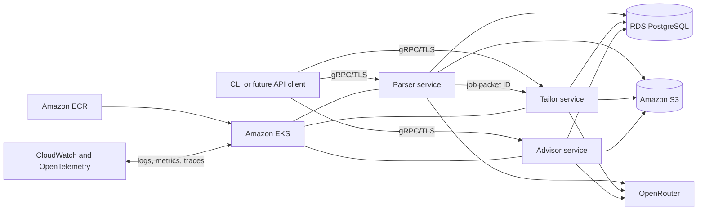

# Next phase: containerized gRPC microservices on AWS

## Purpose

Evolve GETKAN-CV from a local CLI application into three independently deployable
Python services:

- **Parser service:** accepts a URL or listing text and produces a validated job
  packet.
- **Tailor service:** accepts a job packet and resume profile, creates tailored
  LaTeX sources, and compiles resume and letter PDFs.
- **Advisor service:** analyzes saved job packets and returns job-search
  recommendations.

The services will communicate over gRPC, run as Docker containers in an Amazon
EKS cluster, store relational metadata in Amazon RDS for PostgreSQL, and store
source and generated files in Amazon S3. The existing CLI should remain usable
as a gRPC client during migration.

## Scope and non-goals

### In scope

- Define versioned protobuf contracts for parser, tailor, and advisor operations.
- Extract each application function behind a Python gRPC server.
- Persist jobs, workflow state, artifact metadata, and failure information in
  PostgreSQL.
- Store raw listings, resume sources, generated TeX, logs, and PDFs in S3.
- Package each service as a non-root Docker image.
- Support local development with Docker Compose and production deployment to
  EKS.
- Provision AWS infrastructure with infrastructure as code.
- Add health checks, structured logs, metrics, traces, retries, and request IDs.

### Non-goals for this phase

- A browser UI.
- Automated submission of job applications.
- Multi-region active-active deployment.
- Replacing OpenRouter or XeLaTeX unless operational evidence requires it.
- Splitting PostgreSQL into one physical database per service. Logical ownership
  is required first; physical separation can follow when scaling requires it.

## Target architecture



### AWS service mapping

| Concern | AWS service | Notes |
| --- | --- | --- |
| Container orchestration | Amazon EKS | Kubernetes cluster with managed node groups initially. |
| Container registry | Amazon ECR | One repository per deployable service. |
| Relational state | Amazon RDS for PostgreSQL | Private subnets, encryption, automated backups, Multi-AZ for production. |
| Artifact storage | Amazon S3 | Versioning, server-side encryption, lifecycle policies, blocked public access. |
| External gRPC ingress | AWS Load Balancer Controller with ALB | ALB supports HTTP/2 gRPC target groups; internal calls use Kubernetes DNS. |
| Secrets | AWS Secrets Manager | OpenRouter key and database credentials; do not bake secrets into images. |
| Workload identity | EKS Pod Identity or IAM Roles for Service Accounts | Grant each service only its required S3 and Secrets Manager actions. |
| Observability | Amazon CloudWatch and AWS Distro for OpenTelemetry | Central logs, service metrics, traces, dashboards, and alarms. |
| DNS and certificates | Route 53 and AWS Certificate Manager | TLS certificate and service hostname for public ingress, if needed. |
| Infrastructure as code | Terraform or AWS CDK | Choose one before implementation and use it for every environment. |

## Service boundaries and ownership

### Parser service

**Owns:** listing acquisition, extraction, normalization, validation,
compatibility scoring, and parser prompt configuration.

**Writes:** job records, validation results, raw listing objects, and normalized
job-packet objects.

**Initial RPCs:**

```proto
service ParserService {
  rpc ParseJob(ParseJobRequest) returns (ParseJobResponse);
  rpc GetJob(GetJobRequest) returns (JobPacket);
}
```

### Tailor service

**Owns:** truth-preserving rewriting, layout profiles, LaTeX source generation,
XeLaTeX execution, page-count checks, and publication of generated artifacts.

**Writes:** tailoring-run state, selected layout profile, generated TeX objects,
compile logs, and PDF objects.

**Initial RPCs:**

```proto
service TailorService {
  rpc TailorResume(TailorResumeRequest) returns (TailorResumeResponse);
  rpc GetTailoringRun(GetTailoringRunRequest) returns (TailoringRun);
}
```

Tailoring and PDF compilation may exceed normal request deadlines. Start with a
long-running operation pattern: `TailorResume` creates a run and returns its ID;
`GetTailoringRun` reports queued, running, succeeded, or failed state. Do not
hold an ingress connection open for the entire build.

### Advisor service

**Owns:** aggregation of successful job packets, market-demand analysis,
comparison with the resume skills catalog, and advisor prompt configuration.

**Reads:** successful job packets and approved resume-profile data. It must not
read parser or tailor implementation tables directly.

**Initial RPCs:**

```proto
service AdvisorService {
  rpc GenerateAdvice(GenerateAdviceRequest) returns (GenerateAdviceResponse);
  rpc GetAdviceReport(GetAdviceReportRequest) returns (AdviceReport);
}
```

### Boundary rules

- Put shared protobuf definitions in a versioned `proto/getkan/v1/` package.
- Services exchange IDs and typed messages, never local filesystem paths.
- Each service owns its database tables and migrations. Cross-service reads go
  through gRPC or an intentionally published read model.
- Store object keys and checksums in PostgreSQL; store large or unstructured
  content in S3.
- Use immutable, content-addressed or run-scoped S3 keys such as
  `jobs/<job_id>/source/raw-listing.txt` and
  `jobs/<job_id>/tailoring/<run_id>/resume.pdf`.
- Include `request_id`, `job_id`, contract version, creation time, and actor in
  every workflow record.
- Preserve the rule that failed parses cannot trigger tailoring and are excluded
  from advice.

## Data model

A first PostgreSQL schema should cover:

- `jobs`: source, company, title, status, compatibility score, timestamps.
- `job_requirements`: normalized must-have and nice-to-have requirements.
- `validation_errors`: parser validation failures associated with a job.
- `artifacts`: owner service, job ID, run ID, artifact type, S3 key, checksum,
  content type, and size.
- `tailoring_runs`: state, model, layout profile, error summary, timestamps.
- `advice_runs`: input selection, state, model, result artifact ID, timestamps.
- `outbox_events`: durable state-change events for later asynchronous processing.

Use Alembic migrations and SQLAlchemy 2.x. Keep database transactions local to
one service operation; do not introduce distributed transactions. Add an
outbox worker or managed queue only when asynchronous service-to-service
execution is implemented.

## Repository direction

A monorepo remains appropriate while contracts and domain rules are evolving:

```text
proto/getkan/v1/
services/
  parser/
  tailor/
  advisor/
packages/
  contracts/
  observability/
infra/
  environments/
  modules/
deploy/
  base/
  overlays/
docker-compose.yml
```

Move business logic out of `src/application/` incrementally. The first service
wrapper should call the current application function so its existing unit tests
remain useful. Only then move owned code into the service package.

## Delivery plan

### Stage 0: architecture decisions and baseline

- Record decisions for EKS, PostgreSQL, S3 key conventions, infrastructure as
  code, sync versus long-running RPCs, and authentication.
- Measure current parser, tailor, and advisor execution time, memory, artifact
  size, and failure behavior.
- Define service-level objectives and cost limits for a development environment.

**Exit criteria:** decisions are recorded; baseline tests pass; expected AWS
monthly cost and teardown procedure are documented.

### Stage 1: contracts and local platform

- Define protobuf messages, error codes, pagination, deadlines, and API
  versioning under `getkan.v1`.
- Generate Python clients and server stubs with `grpcio-tools`.
- Add gRPC health checking and reflection in development only.
- Add PostgreSQL, an S3-compatible local store, and the three services to Docker
  Compose.
- Add contract tests that start each server and call it through a generated
  client.

**Exit criteria:** all three services respond to health checks; contract tests
run locally; no service depends on host filesystem paths.

### Stage 2: parser extraction

- Extract parser logic first because it has the smallest artifact and LaTeX
  surface.
- Persist job metadata in PostgreSQL and listing/job-packet objects in S3.
- Update the CLI parse command to call the parser client while preserving its
  current JSON output and failure semantics.

**Exit criteria:** existing parser tests and new integration tests pass against
containers; failed packets remain isolated.

### Stage 3: tailor extraction

- Build a tailor image containing pinned XeLaTeX dependencies and fonts.
- Implement asynchronous tailoring-run state and idempotency keys.
- Download inputs into an ephemeral working directory, compile, upload outputs,
  verify checksums, and delete local temporary files.
- Set CPU, memory, and ephemeral-storage requests and limits from measured data.

**Exit criteria:** repeated requests with the same idempotency key do not create
conflicting runs; generated PDFs match current acceptance checks; failed builds
retain useful logs without leaking secrets.

### Stage 4: advisor extraction

- Replace filesystem scans with queries against the published successful-job
  read model.
- Persist advice runs and reports, and preserve exclusion of failed parses.

**Exit criteria:** current advisor behavior passes against seeded PostgreSQL and
S3 fixtures; failed jobs are excluded by integration tests.

### Stage 5: AWS foundation and deployment

- Provision VPC, private subnets, EKS, ECR, RDS, S3, IAM, Secrets Manager,
  ingress, DNS, certificates, logging, backup, and budgets through the selected
  infrastructure-as-code tool.
- Push immutable images tagged with Git commit SHA and deploy pinned digests.
- Run database migrations as a dedicated deployment job.
- Add readiness, liveness, startup, and gRPC health probes.
- Add network policies, pod disruption budgets, autoscaling, and restrictive
  security contexts.

**Exit criteria:** a clean development AWS account can be created from code;
smoke tests parse, tailor, and advise through deployed endpoints; teardown is
verified.

### Stage 6: delivery and operations

- Add CI checks for formatting, typing, unit tests, protobuf compatibility,
  image scanning, container builds, and infrastructure validation.
- Add CD promotion from development to production with manual approval.
- Add dashboards and alarms for RPC error rate, latency, pod restarts, database
  connections, queue depth or active runs, S3 failures, and OpenRouter errors.
- Write runbooks for failed migrations, stuck tailoring runs, rollback, secret
  rotation, database restore, and cluster teardown.

**Exit criteria:** rollback and restore are exercised; alerts reach the intended
operator; production deployment uses the same artifacts validated in
pre-production.

## Security and reliability requirements

- Keep EKS nodes and RDS in private subnets; expose only the required ingress.
- Require TLS for external gRPC and encryption in transit to PostgreSQL.
- Block all public S3 access and enable encryption, versioning, and access logs.
- Use workload identity and least-privilege IAM; never distribute static AWS
  access keys to containers.
- Run containers as non-root with read-only root filesystems where XeLaTeX
  permits, dropping Linux capabilities and writing only to an ephemeral volume.
- Validate URL schemes and restrict outbound access to reduce server-side
  request forgery risk in listing retrieval.
- Set gRPC deadlines, message-size limits, retry policies, and idempotency keys.
  Retry only transient and idempotent operations.
- Back up RDS automatically and test point-in-time restore. Define S3 retention
  and deletion policies for personally identifying resume data.
- Pin Python and system dependencies and scan source, images, and IaC in CI.

## Testing strategy

- **Unit tests:** business rules without network, PostgreSQL, S3, or OpenRouter.
- **Contract tests:** generated clients against each in-process or containerized
  gRPC server, including status-code and backward-compatibility checks.
- **Integration tests:** PostgreSQL and local S3-compatible storage with real
  migrations and artifact checksums.
- **Container tests:** health checks, non-root user, read-only inputs, XeLaTeX
  compilation, and graceful shutdown.
- **End-to-end tests:** parse, tailor, and advise through deployed development
  endpoints using a synthetic resume and listing.
- **Operational tests:** pod termination during a run, duplicate requests,
  dependency timeouts, RDS restore, image rollback, and environment teardown.

## Initial technology set

| Area | Initial choice |
| --- | --- |
| Runtime | Python 3.12, subject to dependency validation |
| RPC | `grpcio`, `grpcio-tools`, `protobuf`, `grpcio-health-checking` |
| Database | PostgreSQL, SQLAlchemy 2.x, Alembic, `psycopg` |
| AWS SDK | `boto3` |
| Validation/settings | Existing dataclasses initially; evaluate Pydantic only if it removes duplication |
| Observability | OpenTelemetry SDK and OTLP exporter |
| Local environment | Docker Compose with PostgreSQL and an S3-compatible test service |
| Kubernetes packaging | Plain manifests with Kustomize overlays initially; adopt Helm only when templating needs justify it |
| IaC | Terraform or AWS CDK; select one in Stage 0 |

## Learning resources

### Python microservices and gRPC

- [gRPC Python quick start](https://grpc.io/docs/languages/python/quickstart/)
- [gRPC Python basics tutorial](https://grpc.io/docs/languages/python/basics/)
- [Protocol Buffers documentation](https://protobuf.dev/overview/)
- [gRPC health checking guide](https://grpc.io/docs/guides/health-checking/)
- [gRPC deadlines guide](https://grpc.io/docs/guides/deadlines/)
- [gRPC retry guide](https://grpc.io/docs/guides/retry/)
- [Docker Python container guide](https://docs.docker.com/language/python/containerize/)
- [SQLAlchemy unified tutorial](https://docs.sqlalchemy.org/en/20/tutorial/)
- [Alembic tutorial](https://alembic.sqlalchemy.org/en/latest/tutorial.html)
- [OpenTelemetry Python documentation](https://opentelemetry.io/docs/languages/python/)

### Kubernetes and AWS deployment

- [Kubernetes Deployments](https://kubernetes.io/docs/concepts/workloads/controllers/deployment/)
- [Kubernetes probes](https://kubernetes.io/docs/concepts/configuration/liveness-readiness-startup-probes/)
- [Amazon EKS getting started](https://docs.aws.amazon.com/eks/latest/userguide/getting-started.html)
- [Amazon EKS best practices guide](https://docs.aws.amazon.com/eks/latest/best-practices/introduction.html)
- [AWS Load Balancer Controller on EKS](https://docs.aws.amazon.com/eks/latest/userguide/aws-load-balancer-controller.html)
- [Application Load Balancer support for gRPC](https://docs.aws.amazon.com/elasticloadbalancing/latest/application/load-balancer-target-groups.html#target-group-protocol-version)
- [Amazon ECR getting started](https://docs.aws.amazon.com/AmazonECR/latest/userguide/getting-started-cli.html)
- [Amazon RDS for PostgreSQL](https://docs.aws.amazon.com/AmazonRDS/latest/UserGuide/CHAP_PostgreSQL.html)
- [Amazon S3 security best practices](https://docs.aws.amazon.com/AmazonS3/latest/userguide/security-best-practices.html)
- [EKS Pod Identities](https://docs.aws.amazon.com/eks/latest/userguide/pod-identities.html)
- [AWS Secrets Manager best practices](https://docs.aws.amazon.com/secretsmanager/latest/userguide/best-practices.html)
- [AWS Distro for OpenTelemetry on EKS](https://docs.aws.amazon.com/eks/latest/userguide/observability.html)
- [AWS Well-Architected Framework](https://docs.aws.amazon.com/wellarchitected/latest/framework/welcome.html)
- [Terraform AWS provider documentation](https://registry.terraform.io/providers/hashicorp/aws/latest/docs)
- [AWS CDK documentation](https://docs.aws.amazon.com/cdk/v2/guide/home.html)

## Decisions required before implementation

1. Choose Terraform or AWS CDK for infrastructure as code.
2. Decide whether any gRPC endpoint must be public. Prefer a private endpoint or
   VPN-protected access for a single-user system.
3. Choose the asynchronous execution mechanism for tailoring: PostgreSQL-backed
   worker initially, or Amazon SQS if independent worker scaling is required.
4. Set development and production availability targets and monthly cost limits.
5. Define retention periods for raw listings, generated resumes, build logs,
   database backups, and S3 object versions.
6. Decide whether advisor reports are small structured rows or versioned S3
   artifacts with relational metadata.

Implementation should begin only after these decisions are recorded, because
they affect networking, contracts, infrastructure layout, and operating cost.
